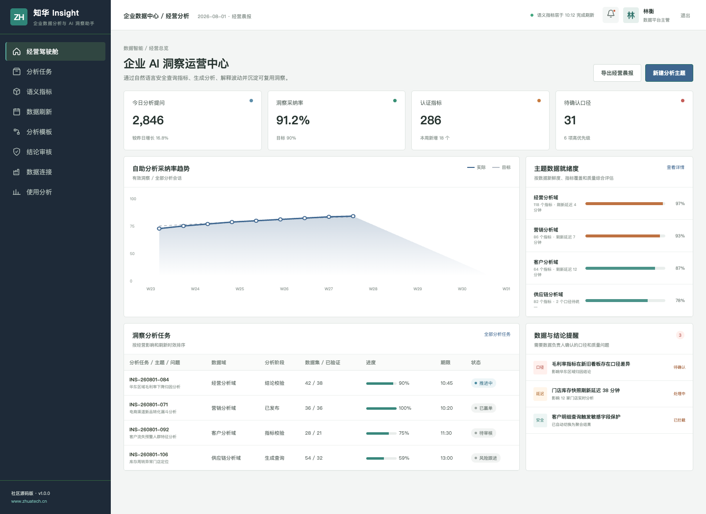
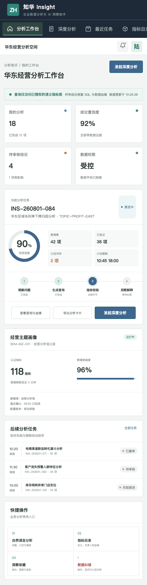

# ZhuaTech Insight｜企业数据分析与 AI 洞察助手

> 自然语言提问只是入口，可信指标、权限控制、查询证据和人工确认才是企业分析的基础。

ZhuaTech Insight 由[知华科技（上海如静知华信息科技有限公司）](https://www.zhuatech.cn/)发布，面向经营、营销、客户和供应链分析场景。



## 产品设计原则

1. **基于语义指标层回答**：统一指标定义、维度、负责人和数据血缘。
2. **每个结论都有证据**：保留查询计划、SQL、数据版本和置信度。
3. **权限跟随用户身份**：行列权限、敏感字段脱敏和查询审计贯穿全程。
4. **关键结论人工确认**：AI 用于分析辅助，不替代经营决策责任。

平台包含自然语言分析、指标目录、洞察卡片、结论审核、数据质量、刷新 SLA、分析模板与使用价值评估。



## 本地运行

```bash
cd frontend
npm install
npm run dev:demo
```

- 管理端账号：`planner / Demo@2026`
- 分析端账号：`operator / Demo@2026`
- 后端：Java 21、Spring Boot、Security、JWT、JPA、Flyway
- 前端：Vue 3、Pinia、Vue Router、Axios、Vite
- 数据库：MySQL 8；测试：H2
- 工程包名：`cn.zhuatech.insight`

接口、架构和部署细节见 [API](docs/api.md)、[架构](docs/architecture.md)、[数据库](docs/database.md)和[部署说明](deploy/README.md)。

## 授权声明

该工程仅能用于个人学习、研究与非商业交流，**不得商用**。任何企业内部使用、生产部署、项目交付、SaaS 服务、收费培训、二次销售、品牌替换或商业再分发，都需要上海如静知华信息科技有限公司书面授权，以 [LICENSE](LICENSE) 为准。

需要私有数据接入、语义指标建设、模型适配和深度定制，请访问[知华科技官网](https://www.zhuatech.cn/)或扫码联系：

| 微信一 | 微信二 |
| --- | --- |
|  |  |

SEO：AI 数据分析源码、自然语言 BI、企业数据助手、指标语义层、Text to SQL、Java BI、Vue 数据分析、知华科技。
